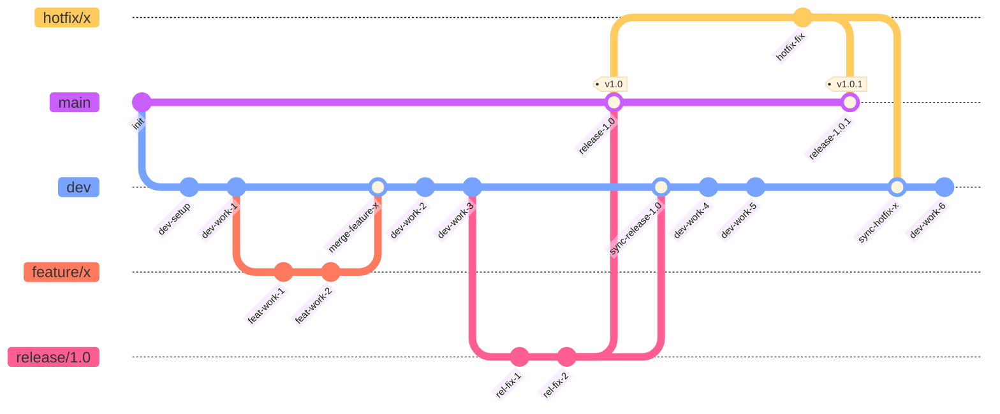

# Solvix

## Branching strategy

This project follows **Git Flow**:

- `main` — always stable, release-ready code. Never committed to directly.
- `dev` — integration branch for all features and regular fixes.
- `feature/*` — new functionality, branched from `dev`, merged back into `dev`.
- `fix/*` — regular (non-critical) bug fixes, branched from `dev`, merged back into `dev`.
- `release/<version>` — release stabilization, branched from `dev`, merged into both `main` and `dev`, then deleted.
- `hotfix/*` — critical production fixes, branched from `main`, merged into both `main` and `dev`.

Full details: [`docs/BRANCHING.md`](docs/BRANCHING.md).