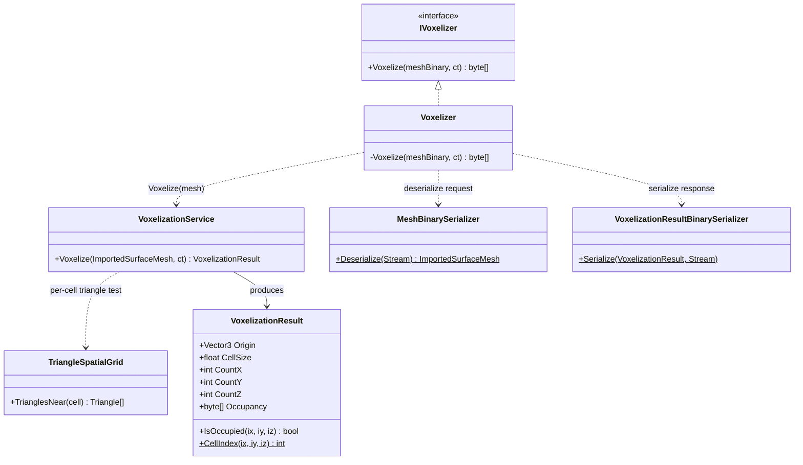
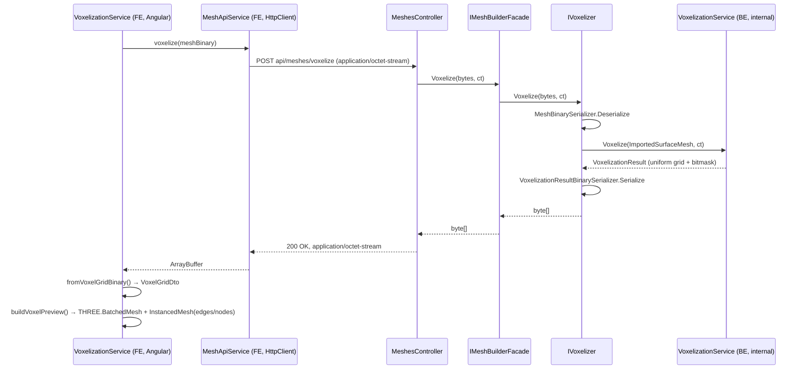

# Backend Architecture — Solvix.Api та суміжні проєкти

Опис .NET-розв'язку: які проєкти існують, хто на кого посилається, і де саме
живе (чи поки не живе) той чи інший алгоритм/клас. Доповнює
`docs/FRONTEND_ARCHITECTURE.md` (той описує лише `solvix-web`) — разом вони
дають повну картину "від кліку у браузері до відповіді сервера і назад".

Статус: актуально станом на `dev` після PR #14 (`feature/voxel-geometry-rules`)
та `feature/voxel-fill-frontside`. Єдиний реально реалізований HTTP-ендпоінт —
вокселізація; `Solvix.Solver`/`Solvix.Bridge`/`Solvix.Data` — заглушки
(детально нижче).

---

## Проєкти розв'язку і залежності

```
Solvix.Api
 ├── Solvix.Contracts      (інтерфейси-фасади, спільна "мова" між проєктами)
 ├── Solvix.MeshBuilder ──> Solvix.Voxelization
 ├── Solvix.Solver
 ├── Solvix.Bridge
 └── Solvix.Data           (EF Core + Npgsql, DbContext)
```

- **`Solvix.Contracts`** — без залежностей. Містить лише два інтерфейси:
  `Facades/IMeshBuilderFacade.cs` (`byte[] Voxelize(byte[] meshBinary, CancellationToken)`)
  і `Facades/ISolverFacade.cs` (**порожній**, жодного члена). Це єдина "спільна
  мова" — `Solvix.Api` ніколи не залежить від `Solvix.MeshBuilder`/`Solvix.Solver`
  напряму по конкретних класах, лише по цих інтерфейсах.
- **`Solvix.MeshBuilder`** — тонкий фасад-перекладач над `Solvix.Voxelization`.
  Єдиний нетривіальний файл — `MeshBuilderFacade.cs`: приймає
  `IVoxelizer` (з `Voxelization`), викликає `Voxelize()`, ловить
  `VoxelizationTooLargeException`/`MalformedMeshException` і перекладає їх у
  свої власні `MeshTooLargeException`/`InvalidMeshException` — `Solvix.Api`
  ніколи не бачить (і не повинен знати) типи винятків `Voxelization`.
- **`Solvix.Voxelization`** — ізольований проєкт, **де насправді живе весь
  алгоритм вокселізації**. Публічний "шов" — рівно один інтерфейс `IVoxelizer`;
  усе інше (`Voxelizer`, `VoxelizationService`, `VoxelizationResult`,
  `Triangle`, `TriangleSpatialGrid`, обидва бінарні серіалізатори) —
  `internal`, відкрито лише власним тестам через `InternalsVisibleTo`.
  Детально нижче.
- **`Solvix.Solver`** — `SolverFacade : ISolverFacade`, реалізує порожній
  інтерфейс. Нічого не робить — заготовка під майбутній розв'язувач.
- **`Solvix.Bridge`** — клас `Bridge`, приймає `IMeshBuilderFacade` +
  `ISolverFacade` через конструктор, **не має жодного публічного методу**.
  Зареєстрований у DI (`Program.cs`), але ніхто його не інжектить і не
  викликає. Задуманий як міст, що з'єднає результат вокселізації з
  результатом солвера (детальніше — `docs/IDEAS.md`, R4), коли обидва боки
  матимуть що з'єднувати.
- **`Solvix.Data`** — `SolvixDbContext : DbContext`, **без жодного
  `DbSet<>`**. `Program.cs` викликає `AddDbContext`+`Database.Migrate()` при
  старті, але міграцій ще немає (порожня схема), і `ConnectionStrings:Default`
  у `appsettings.json` (не `.Development.json`) — порожній рядок.

---

## `Solvix.Voxelization` — де саме живе алгоритм



Все `internal` — цей граф повністю прихований за `IVoxelizer`. `Voxelizer.Voxelize`
(`Solvix.Voxelization/Voxelizer.cs:12-22`) — єдина точка входу: deserialize →
`new VoxelizationService().Voxelize(mesh, ct)` → serialize.
`VoxelizationService` (описано в `docs/VOXELIZATION_PERF.md`) — сам алгоритм:
для кожної клітинки рівномірної сітки (`Parallel.For` по X-зрізах) вирішує
"зайнята/не зайнята" через `TriangleSpatialGrid` (SAT-тест трикутник-проти-кубика
або ray-parity, залежно від відстані до поверхні), пакує результат у
бітмаску (`VoxelizationResult.Occupancy`).

**`VoxelizationResult` (`Solvix.Voxelization/VoxelizationResult.cs:15`) — це і
є бекенд-відповідник фронтендового `VoxelGridDto`**
(`solvix-web/src/app/geometry/voxel-grid-contract.ts:14`): один `CellSize` на
всю сітку, позиція клітинки виводиться з індексу
(`Origin + CellSize*(ix,iy,iz)`), лінеаризація ідентична
(`ix` найшвидше, потім `iy`, потім `iz` — має лишатись синхронною з
фронтендовим `cellIndex()`). **Той самий структурний обмежувач, про який
щойно йшлося** — рівномірна сітка з одним розміром клітинки, без місця для
клітинок різного розміру (потрібно для локального згущення).

---

## Повний потік вокселізації — від кліку до рендеру



Ключове: **обидва боки говорять однаковим бінарним форматом "uniform grid +
bitmask"**, синхронізованим вручну (немає спільної схеми/кодогенерації) між
`VoxelizationResultBinarySerializer.cs` (BE) і
`voxel-grid-contract.ts::fromVoxelGridBinary` (FE) — коментарі в обох файлах
явно посилаються один на одного.

Помилки (`MeshTooLargeException`/`InvalidMeshException`, кинуті
`Solvix.MeshBuilder`) переходять у `MeshesController` в `400 BadRequest` з
JSON-тілом (`{CellCount, Limit}` / `{Message}`), яке фронтендовий
`mesh-api.service.ts` (`parseVoxelizationTooLargeError`/`parseInvalidMeshError`)
розпарсює назад у типізований `VoxelizationStatus`.

---

## Де зараз НЕМАЄ коду (важливо для планування локального згущення)

- **Жодного класу `Hexahedron`/`Node`/`Mesh`(nodes+elements) немає в жодному
  C#-проєкті.** `docs/IDEAS.md` explicitly позначає цю структуру як
  "(обговорено, не закодовано)".
- **`IMeshBuilderFacade` має рівно один метод — `Voxelize`.** Немає
  `GetCurrentMesh()`, немає жодного способу дістати щось окрім сирого бінарного
  результату вокселізації.
- **`ISolverFacade` — порожній.** Немає `Solve(Mesh)`, немає жодного DTO для
  результатів розрахунку.
- **`MeshesController` має рівно один ендпоінт** (`POST api/meshes/voxelize`).
  Немає ендпоінтів збереження/завантаження, немає ендпоінту "дай мені
  трансльовану hex-структуру".
- **`Bridge` — порожній клас без методів.** Зареєстрований у DI, нічого не
  викликає і ніхто не викликає його.

Тобто "транслятор `VoxelizationResult → Hex/Node граф`", про який щойно
йшлося — це буде **новий код у новому місці** (ймовірний кандидат:
новий internal-клас усередині `Solvix.MeshBuilder`, або новий проєкт
`Solvix.Mesh`/`Solvix.Refinement`, якщо хочемо ізолювати його від
вокселізації так само, як `Voxelization` вже ізольована від `MeshBuilder`) —
не розширення чогось наявного.