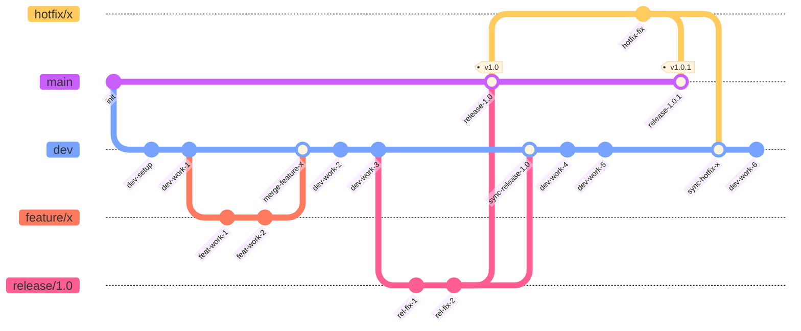

# Git Strategy (Solvix)

The project follows the classic **Git Flow** model. Agreed with the user on 2026-07-30.

## Branches

- **`main`** — the most stable code, only what has actually been released (production/release-ready). Direct commits to `main` are forbidden — code only lands here through a merge from `release/*` or `hotfix/*`.
- **`dev`** — the main development/integration branch. All new features and regular bug fixes merge here.
- **`feature/<name>`** — new functionality. Branched from `dev`, merged back into `dev`.
- **`fix/<name>`** — a regular bug fix (non-critical, not production). Branched from `dev`, merged back into `dev`.
- **`release/<version>`** (e.g. `release/1.0`) — preparation of a specific release: branched from `dev` once `dev` is ready to ship. Only stabilization happens here (small fixes, no new features). Once ready, it's merged into both `main` and back into `dev`. The branch is deleted after merging.
- **`hotfix/<name>`** — a critical fix to production code. Branched from `main`, merged into both `main` and `dev`.

## Merge flow

## Rules

1. New features start only from `dev` and merge only into `dev`.
2. Regular (non-critical) bugs are also fixed from `dev` and merged into `dev`.
3. A release is prepared in a dedicated `release/<version>` branch, created from `dev`; once done, it's merged into both `main` and `dev`, then deleted.
4. Critical hotfixes (production bugs) branch **only from `main`**, and after the fix are merged into both `main` and `dev`.
5. Code never lands in `main` directly — only through `release/*` or `hotfix/*`.