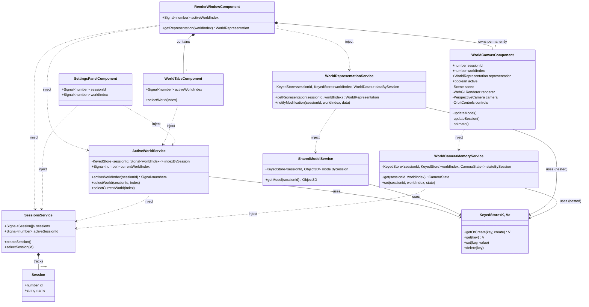

# Frontend Architecture — Solvix Web

Опис структури `solvix-web`: хто з ким вкладений, хто чим володіє, і де живе стан.

Статус: реалізовано в `fix/shared-world-canvases`, закриття сесій — у `feature/close-session`.

---

## Ієрархія вкладеності (хто кого містить)

```
AppComponent                     (1, завжди)
├── SessionTabsComponent          — читає SessionsService напряму
├── ToolbarPanelComponent         — статичний, без стану
├── as-split (unit="percent")
│   ├── RenderWindowComponent     (1, завжди)
│   │   ├── WorldTabsComponent    (1)
│   │   └── WorldCanvasComponent  (× 3, назавжди — Ideal/Real/Solver)
│   └── SettingsPanelComponent    (1, завжди)
└── FooterComponent
```

Ключове: **жоден із цих компонентів не створюється "на сесію"**. Скільки б сесій не було відкрито — дерево компонентів однакове. Сесії існують лише як **дані** в сервісах, не як частини компонентного дерева.

---

## Чому саме так: обмежена кількість WebGL-контекстів

Перша версія цієї архітектури створювала окремий `WorldCanvasComponent` (і окремий WebGL-контекст) на кожну пару (сесія, World) — N сесій × 3 World'и = 3N живих контекстів, що ніколи не звільнялись (закриття сесії й досі не реалізоване). Браузери мають жорсткий ліміт одночасних WebGL-контекстів (~8-16) — після кількох сесій нові канваси переставали отримувати контекст узагалі.

Рішення: **World — фіксований, спільний на весь застосунок "слот для малювання"**, не щось, що належить сесії. Існує рівно 3 `WorldCanvasComponent` (за довжиною `WORLDS_CONFIG`), створені один раз при старті й ніколи не знищувані. Перемикання сесій **не створює й не знищує жодного канваса** — лише міняє, що́ ці 3 канваси показують.

---

## Сервіси стану — усі `root`-scoped, ключовані по `sessionId` (і, де треба, `worldIndex`)

### `state/keyed-store.ts` — `KeyedStore<K, V>`
Спільний хелпер: лінива мапа "є значення за ключем — віддай, нема — створи дефолт і збережи" (`getOrCreate`), плюс звичайні `get`/`set`/`delete`. Виник тому, що цей патерн був буквально скопійований у 4 місцях (`ActiveWorldService`, `SharedModelService`, `WorldRepresentationService`, камера в `WorldCanvasComponent`) — тепер він написаний один раз.

### `state/sessions.service.ts` — `SessionsService`
Список сесій (`Session[]` = `{id, name}`) + `activeSessionId: number | null`. `createSession()` додає сесію і одразу робить активною — необмежена кількість. `closeSession(id)` видаляє сесію зі списку; якщо закривалась активна — обирає сусідню (індекс `min(closingIndex, remaining.length - 1)`), а якщо сесій не лишилось — `activeSessionId` стає `null`. `id` не перевикористовується (`nextId` лише зростає) — навмисно, бо очистка `KeyedStore`-мап у нижчих сервісах іде через `effect()` асинхронно, і перевикористаний id міг би на мить дочитати чужі старі дані. Нічого не знає про World'и чи модель — це нижче.

### `state/active-world.service.ts` — `ActiveWorldService`
`KeyedStore<sessionId, Signal<worldIndex>>`. Який World-таб (Ideal/Real/Solver) відкритий — **окремий запис на кожну сесію**, лениво створюваний при першому зверненні. Це дає "сесія 1 на Solver, сесія 2 на Ideal" одночасно. `currentWorldIndex` — `computed`, що сам читає `SessionsService.activeSessionId()` і резолвить `activeWorldIndex(sessionId)` для активної сесії, повертаючи `null`, якщо сесій нема; `selectCurrentWorld(index)` — те саме для запису. Єдине джерело цього null-safe резолву — `RenderWindowComponent`, `WorldTabsComponent`, `SettingsPanelComponent` читають саме `currentWorldIndex`, а не кожен переозначає його по-своєму (раніше так і було — та сама логіка була продубльована в усіх трьох, і `RenderWindowComponent`/`WorldTabsComponent` позначали "нема сесії" через `-1`, а `SettingsPanelComponent` — через `null`).

### `state/shared-model.service.ts` — `SharedModelService`
`KeyedStore<sessionId, THREE.Object3D>`. Модель кожної сесії — окремий об'єкт у мапі. Початкову модель сервіс **не хардкодить сам** — приймає через інжектований `INITIAL_MODEL_FACTORY` (`InjectionToken` з дефолтним провайдером-плейсхолдером, `THREE.Mesh` з кубом). Підмінити, з чого стартує сесія, можна, переозначивши цей токен де завгодно в конфігурації застосунку — сам сервіс міняти не треба.

`Object3D`, не `BufferGeometry`: модель має нести і геометрію, і матеріал разом (і згодом стати `Group` із багатьох гексаедрів), а не бути голою формою без стилю.

### `state/world-representation.service.ts` — `WorldRepresentationService`
`KeyedStore<sessionId, KeyedStore<worldIndex, WorldData>>` (вкладено). `getRepresentation(sessionId, worldIndex)` повертає:
```ts
interface WorldRepresentation {
  readonly object: THREE.Object3D;   // спільна модель сесії (з SharedModelService)
  readonly data: WorldData | null;   // власні дані ЦЬОГО World'у про представлення
}
```
`WorldData` — поки порожній тип-заглушка (`interface WorldData {}`) — форма не визначена, це "шов" для майбутньої логіки. `notifyModification(sessionId, worldIndex, data)` — заглушка для запису; **зараз нічого в коді її не викликає**. `getRepresentation` наразі ігнорує `worldIndex` при виборі `object` — усі 3 World'и бачать одну й ту саму модель, лише `data` теоретично різна (і поки завжди `null`).

### `state/world-camera-memory.service.ts` — `WorldCameraMemoryService`
`KeyedStore<sessionId, KeyedStore<worldIndex, CameraState>>` (вкладено, та сама форма, що й `WorldRepresentationService`). Пам'ятає кут камери (`camera.position`/`controls.target`) для кожної пари (сесія, World). Раніше цей стан жив **усередині** `WorldCanvasComponent` — свій приватний `KeyedStore` і свій `effect()`-очищувач на кожен із 3 інстансів компонента (4-та копія того самого патерну "лениво створюваний, per-session стан з чисткою по `pruneTo`", що й у трьох інших `root`-сервісах, але не поряд із ними, і без юніт-тесту — компонентний `effect()` вимагав повного `TestBed.createComponent()` + WebGL, щоб перевірити). Винесено в root-сервіс, щоб очистка була консистентна й тестована так само, як у решти трьох. `WorldCanvasComponent` отримав `@Input worldIndex` — раніше йому це було не потрібно (він і так один на весь World), а тепер це ключ у сервіс, яким він себе ідентифікує серед трьох.

### `state/render-settings-split.service.ts` — `RenderSettingsSplitService`
Не пов'язаний із сесіями — ширина панелі налаштувань (`%`), спільна UI-складова. `<as-split unit="percent">`, а не `pixel`: перше монтування `<as-split>` з пиксельними розмірами рахувало layout через сигнальний `effect()`, що резолвився на тик пізніше, ніж перший рендер — коротка "стрибка" розміру. Percent-режим CSS grid (`fr`-одиниці) вирішує це миттєво, без JS-математики проти виміряної ширини контейнера.

### `config/app-settings.ts`
Загальний файл налаштувань застосунку (не лише про World'и, хоч зараз там тільки `WORLDS_CONFIG`) — місце для інших конфігів, коли з'являться.

---

## `WorldCanvasComponent` (×3) — що спільне, що "на сесію"

| Належить World'у (створюється раз, ніколи не скидається) | Належить парі (World, сесія) — зберігається в `WorldCameraMemoryService` |
|---|---|
| `THREE.Scene`, `WebGLRenderer`, `PerspectiveCamera`, `OrbitControls` — самі об'єкти | Кут камери: `camera.position`/`controls.target` — значення всередині цих об'єктів |
| Сам факт рендер-циклу (`animate()`, `checkResize()`) | Клонований `Object3D` у сцені (модель сесії) |

### `@Input`
`sessionId` (яка сесія зараз активна), `worldIndex` (який із 3 інстансів це — ключ у `WorldCameraMemoryService`), `representation: WorldRepresentation` (об'єкт + дані від `WorldRepresentationService`), `active` (чи це обраний World-таб активної сесії — керує `OrbitControls.enabled` і чи взагалі викликається `renderer.render()`).

### `updateModel()` — чому клон, а не оригінал
`WorldRepresentationService` віддає **той самий** `Object3D` усім 3 World'ам однієї сесії. У Three.js вузол сцени може належати лише одній `Scene` водночас — якщо додати оригінал напряму в усі 3 сцени, кожен наступний `scene.add()` **краде** його з попередньої (виграє останній у черзі `*ngFor`, зазвичай Solver). Тому кожен канвас додає у свою сцену `representation.object.clone()` — геометрія/матеріал лишаються спільними посиланнями всередині клону (дешево), але вузол сцени свій.

Після кожної зміни моделі викликається `renderer.compile(scene, camera)` — прогріває шейдер GPU **заздалегідь**, поки World може бути ще прихований. Без цього перша компіляція шейдера (кожна сесія має свій, щойно створений `THREE.Material`) відбувалась синхронно саме в момент показу канваса — коротка біла спалахна непрошейдженої геометрії.

### `updateSession()` — камера як пам'ять сесії
При зміні `sessionId`: зберігає поточну позицію/target камери під ключем (сесія, яку покидаємо, `worldIndex`) через `WorldCameraMemoryService.set`, і відновлює збережений (або дефолтний `[3,3,3]`, якщо World у цій сесії ще не відкривали) стан для нової сесії. `enableDamping` вимикається на один `update()` і вмикається назад — обнуляє залишкову інерцію обертання, щоб стара сесія не "довершувала" рух у новій.

### `ngOnChanges` — фікс блимання при перемиканні
Усі 3 канваси щокадру синхронізують `Scene`/камеру **у фоні**, незалежно від `[hidden]` (`updateModel()`/`updateSession()` викликаються в `animate()` завжди). Але `renderer.render()` — лише коли `active`. Коли `[hidden]` знімається, пікселі на екрані — це те, що намальовано **минулого разу**, коли канвас був активний (можливо, інша сесія). `ngOnChanges` ловить момент, коли `active` стає `true`, і **синхронно** викликає `updateModel()` + `updateSession()` + `renderer.render()` одразу, не чекаючи наступного `requestAnimationFrame`-тіку.

---

## Схема



---

## Закриття сесії: очистка й порожній стан

`SessionTabsComponent` має хрестик на кожній вкладці (навіть коли вона одна) — `closeSession(id)` викликає `SessionsService.closeSession(id)` напряму, без обмежень на мінімальну кількість сесій. Сесій може лишитись 0.

**Очистка стану.** `ActiveWorldService`, `SharedModelService`, `WorldRepresentationService` кожен має в конструкторі `effect()`, що реагує на `sessions.sessions()` і викликає `KeyedStore.pruneTo(...)` — запис закритої сесії видаляється з мапи автоматично, без явного виклику при закритті. `SharedModelService` додатково звільняє GPU-ресурси моделі (`.dispose()` на geometry/material кожного `THREE.Mesh` у дереві) перед видаленням запису. Перевірено тестами (`active-world.service.spec.ts`, `shared-model.service.spec.ts`, `world-representation.service.spec.ts`) — включно з тим, що дані **іншої**, відкритої сесії при цьому не чіпаються.

**Порожній стан (0 сесій).** `AppComponent` рахує `sessions.activeSessionId() === null` і ставить `[hidden]` на `<app-render-window>` і `<app-settings-panel>`, показуючи замість них `.app-layout__empty`-плейсхолдер. `[hidden]`, а не `*ngIf` — компоненти й далі живі (той самий принцип, що й для World-канвасів), просто не видимі. Обидва компоненти мають `:host([hidden]) { display: none; }` у своєму SCSS — без цього правила `[hidden]` не спрацьовує, бо власний `:host { display: ...; }` компонента переважує дефолтне UA-правило браузера для `[hidden]`.

`RenderWindowComponent.activeWorldIndex` і `WorldTabsComponent.activeWorldIndex` при `activeSessionId() === null` повертають сентинел `-1`, який не збігається з жодним реальним індексом World'у (0/1/2) — усі 3 `WorldCanvasComponent` лишаються неактивними, нічого не намагається рендерити неіснуючу сесію.

---

## Ключові принципи

1. **Рівно 3 WebGL-контексти за весь час роботи застосунку**, незалежно від кількості сесій.
2. **Що ми малюємо визначає сесія; як ми малюємо визначає World.** Модель (`SharedModelService`) — за сесією. Camera/Renderer/Controls (`WorldCanvasComponent`) — за World'ом, спільні для всіх сесій.
3. **Кут камери — своя пам'ять на пару (World, сесія)**, попри спільний канвас: зберігається в `KeyedStore` усередині кожного `WorldCanvasComponent`.
4. **Який World-таб відкритий — пам'ять сесії** (`ActiveWorldService`, ключ — `sessionId`).
5. **Ізоляція сесій — на рівні даних (`KeyedStore`, ключ `sessionId`), не DI-скоупу компонентів.** Попередня версія (per-session `SessionComponent.providers`) не масштабувалась через ліміт WebGL-контекстів.
6. **`[hidden]`, не `*ngIf`** — неактивний World не знищується, `updateModel()`/`updateSession()` для нього все одно виконуються щокадру у фоні.
7. **Кількість World'ів — з конфігу; кількість сесій — необмежена.** Додати World = запис у `WORLDS_CONFIG` (`config/app-settings.ts`) — це також додасть ще один постійний WebGL-контекст, свідомий компроміс. Додати сесію = "+" у `SessionTabsComponent`, без жодних нових WebGL-ресурсів.

---

## Відомий технічний борг

- **`WorldRepresentationService.notifyModification` не має жодного викликача** — увесь механізм `WorldData` зараз неактивний, `data` завжди `null`.
- **`getRepresentation` ігнорує `worldIndex`** — "кожен World представляє модель по-своєму" поки що не реалізовано, усі 3 World'и бачать ідентичний `object`.