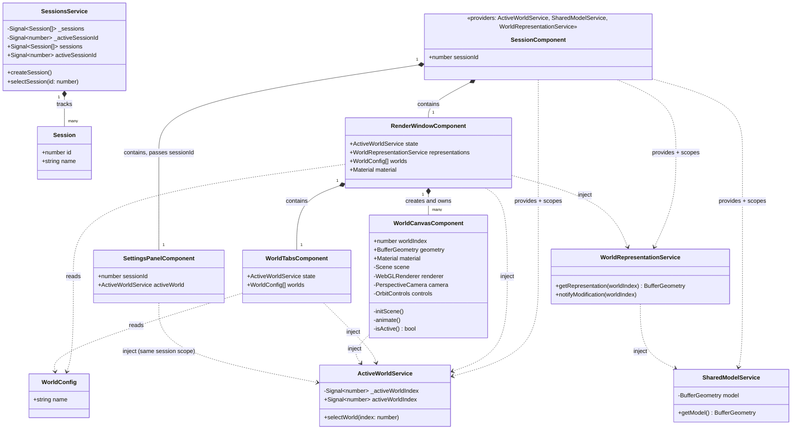

# Frontend Architecture — Solvix Web

Опис структури `solvix-web`: хто з ким вкладений, хто чим володіє, і де живе стан.

Статус: реалізовано в `feature/cad-editor-ui`.

---

## Ієрархія вкладеності (хто кого містить)

```
AppComponent                        — загальне вікно застосунку
├── SessionTabsComponent             — секція сесійних вкладок (керує SessionsService)
├── ToolbarPanelComponent            — набір іконок-інструментів
└── SessionComponent  (× N, одна на сесію)   — ізольований DI-скоуп однієї сесії
    ├── RenderWindowComponent        — головне вікно для 3D виводу цієї сесії
    │   ├── WorldTabsComponent        — секція вкладок World'ів
    │   └── WorldCanvasComponent (×3) — власний 3D вивід кожного World'у
    └── SettingsPanelComponent       — блок з налаштуваннями цієї сесії

FooterComponent                     — міні-футер з інфою (сиблінг SessionComponent, поза ним)
```

`RenderWindowComponent` — єдиний, хто фізично містить `WorldTabsComponent` і список `WorldCanvasComponent`: вкладки World'ів і сам 3D-вивід — це дві частини одного вікна, а не окремі сиблінги на рівні `AppComponent`.

`SessionComponent` фізично містить і `RenderWindowComponent`, і `SettingsPanelComponent` (в одному `<as-split>`, самостійно керує пропорціями свого лейауту) — не тому, що це один UI-регіон (вони в різних панелях), а тому що `SettingsPanelComponent` має залежати від активного World цієї сесії, а це можливо лише якщо він сидить у тому самому DI-піддереві.

`AppComponent` рендерить `*ngFor` по всіх сесіях з `SessionsService`, по одному `SessionComponent` на сесію, і перемикає видиму через `[hidden]` — так само, як `RenderWindowComponent` перемикає World'и. Неактивна сесія не знищується, а просто ховається CSS'ом: усі сесії "живі" одночасно.

Кількість `WorldCanvasComponent` = довжина `WORLDS_CONFIG`. Кількість `SessionComponent` = довжина `SessionsService.sessions()` — необмежена, сесії створюються кнопкою "+" у `SessionTabsComponent`.

---

## Ізоляція сесій (DI-скоуп, не конфіг)

Кожна сесія має власні: активний World, спільну модель і представлення кожного World'у. Це не глобальний стан — `SessionComponent` оголошує ці сервіси у своєму `providers`:

```ts
providers: [ActiveWorldService, SharedModelService, WorldRepresentationService]
```

Angular створює для кожного інстансу `<app-session>` окремий injector-піддерево з власними, новими інстансами цих трьох сервісів. Усе, що всередині `SessionComponent` (тобто `RenderWindowComponent`, `WorldTabsComponent`, кожен `WorldCanvasComponent`) інжектить ці сервіси через `inject()`, отримує саме інстанс своєї сесії — Angular резолвить найближчий provider вгору по дереву компонентів.

Наслідок: `ActiveWorldService`/`SharedModelService`/`WorldRepresentationService` більше **не** `providedIn: 'root'` — навмисно. Без сесії над ними в дереві їх узагалі не можна заінжектити (DI-помилка) — це enforced-гарантія, що такого стану "нізвідки" не існує.

```
Session A                          Session B
├─ ActiveWorldService (instance A)  ├─ ActiveWorldService (instance B)
├─ SharedModelService (instance A)  ├─ SharedModelService (instance B)
└─ WorldRepresentationService (A)   └─ WorldRepresentationService (B)
```

Нова сесія = нові World'и, новий активний World (скидається на 0), нова спільна модель. Стара сесія цього не бачить і на неї не впливає — ізоляція абсолютна, на рівні інжектора, а не домовленості в коді.

### Унікальний ідентифікатор "яке World зараз відкрите"

`SettingsPanelComponent` має показувати налаштування саме того World'у, який зараз відкритий, у саме тій сесії, якій він належить. Це — пара `(sessionId, worldIndex)`:

- `sessionId` — не з DI, а явний `@Input({ required: true })`, який `SessionComponent` прокидує вниз (`[sessionId]="sessionId"`), бо компонент не може сам знати, до якої сесії належить.
- `worldIndex` — `activeWorld.activeWorldIndex()`, де `activeWorld = inject(ActiveWorldService)` — а оскільки `SettingsPanelComponent` сидить усередині DI-скоупу `SessionComponent`, це завжди `ActiveWorldService` саме цієї сесії, не чужої.

Разом `(sessionId, activeWorld.activeWorldIndex())` однозначно ідентифікують, чиї налаштування показані — навіть коли одночасно існує N сесій × 3 World'и.

### Що НЕ ізольовано per-session: ширина панелей

`SessionComponent` містить власний `<as-split>` (бо `RenderWindowComponent` і `SettingsPanelComponent` мають бути в одному DI-піддереві), але ширини панелей — це UI-шар, не дані сесії. Якщо просто прив'язати `[size]` до локального поля `SessionComponent`, кожна сесія тримає власний стан перетягування ґутера — і при перемиканні між сесіями ширина "стрибає". Тому ширини винесено в root-scoped `PanelLayoutService` (`state/panel-layout.service.ts`): усі `<as-split>` усіх сесій читають і пишуть ті самі два сигнали (`renderWindowWidth`, `settingsWidth`) через `(dragEnd)`. Перетягнув ґутер в одній сесії — бачиш той самий розмір у решті.

---

## Логічна модель (хто чим володіє)

```
кожна Session (їх довільна кількість, максимально ізольовані одна від одної)
  → володіє → Worlds[3]              (ActiveWorldService — хто з них активний, свій на сесію)
  → пам'ятає → спільну модель         (SharedModelService — своя на сесію)

кожен World
  → має власний 3D вивід              (WorldCanvasComponent: своя Scene/Renderer/Camera/Controls)
  → представляє спільну модель по-своєму (WorldRepresentationService, своя на сесію)
```

`SessionsService` (root-scoped) знає лише список сесій `{id, name}` і яка активна — сам вміст сесії (World'и, модель) він не зберігає, це навмисно винесено в per-session DI-скоуп вище.

---

## Схема



---

## Шари

### `state/sessions.service.ts` — `SessionsService`
Root-scoped, єдиний на застосунок. Список сесій (`Session[]`) + який `activeSessionId`. `createSession()` додає нову сесію і одразу робить її активною — сесій можна створити скільки завгодно.

### `layout/session/session.component.ts` — `SessionComponent`
Межа ізоляції. Не має власного шаблону-логіки, окрім `providers` — саме цей масив створює нову, окрему копію `ActiveWorldService`/`SharedModelService`/`WorldRepresentationService` для кожної сесії. Містить один `RenderWindowComponent`.

### `config/worlds.config.ts`
Список World'ів (`{ name: string }[]`), спільний шаблон для кожної сесії. Кількість World'ів у сесії = довжина цього масиву.

### `state/active-world.service.ts` — `ActiveWorldService`
Джерело правди про те, який World зараз активний **у межах однієї сесії**. Angular **signal** (`activeWorldIndex`) + метод `selectWorld(index)`. Інжектиться напряму всіма, кому потрібен цей стан (`WorldTabsComponent`, `RenderWindowComponent`, кожен `WorldCanvasComponent`) — без прокидування через `@Input`/`@Output` по дереву компонентів.

### `state/shared-model.service.ts` — `SharedModelService`
Єдина модель, над якою працюють усі World'и **однієї сесії**. Що це за модель насправді (реальний тип/форма) — не визначено до появи бекенд-контракту; зараз тимчасова заглушка (`THREE.BufferGeometry`).

### `state/world-representation.service.ts` — `WorldRepresentationService`
Прошарок між `SharedModelService` і конкретним World'ом **у межах сесії**: кожен World представляє спільну модель по-своєму, і стан цього представлення зберігається десь окремо для кожного World'у. Як саме — навмисно не визначено; це "шов", у який пізніше підключиться логіка, керована бекендом. `notifyModification(worldIndex)` — заглушка для майбутнього мапінгу змін між World'ами.

### `layout/render-window/render-window.component.ts` — `RenderWindowComponent`
Головне вікно для 3D виводу. Власник **спільного матеріалу** (`THREE.Material`) — суто відображувальна властивість (колір/стиль), не частина питання спільної моделі. Містить `WorldTabsComponent` і рендерить `*ngFor` по `WORLDS_CONFIG`, створюючи по одному `WorldCanvasComponent` на кожен World, передаючи йому `geometry` (через `WorldRepresentationService`) і спільний `material`.

### `layout/render-window/world-tabs/world-tabs.component.ts` — `WorldTabsComponent`
Секція вкладок World'ів усередині `RenderWindowComponent`. Читає список World'ів з конфігу, клік по вкладці викликає `state.selectWorld(i)`.

### `layout/render-window/world-canvas/world-canvas.component.ts` — `WorldCanvasComponent`
Узагальнений, перевикористовуваний компонент — один на кожен World, і є його власним 3D виводом. Кожен інстанс повністю ізольований:
- власний `<canvas>`
- власна `THREE.Scene`
- власний `THREE.WebGLRenderer`
- власні `camera` + `OrbitControls`

Отримує ззовні лише `geometry`/`material` — усе інше не ділиться ні з ким.

---

## Ключові принципи

1. **Один об'єкт малювання, багато World'ів — у межах однієї сесії.** `Material` створюється один раз у `RenderWindowComponent`; `geometry` кожен World отримує через `WorldRepresentationService`, який поки що віддає всім World'ам сесії той самий `SharedModelService.getModel()` цієї сесії.
2. **Сесії максимально ізольовані одна від одної.** Ізоляція — на рівні Angular DI (`SessionComponent.providers`), а не домовленості чи конфігу: нова сесія фізично отримує нові інстанси `ActiveWorldService`/`SharedModelService`/`WorldRepresentationService`.
3. **Повна ізоляція вигляду між World'ами.** Camera/OrbitControls/Scene/Renderer — окремі на кожен World. Ніякого спільного стану камери.
4. **Всі World'и й усі сесії живі одночасно.** Цикл `requestAnimationFrame` у кожному `WorldCanvasComponent` працює завжди, незалежно від активності — `controls.update()` викликається щокадру для кожного. На екран (`renderer.render`) малюється лише той, чий `worldIndex === activeWorldIndex`. Неактивні сесії так само не знищуються, лише ховаються.
5. **`[hidden]`, не `*ngIf`** — і для World'ів, і для сесій. Неактивні лише ховаються CSS'ом (`display: none`), компонент ніколи не знищується й не пересоздається, тому не втрачає стан.
6. **Кількість World'ів — з конфігу; кількість сесій — необмежена.** Додати новий World = додати запис у `WORLDS_CONFIG`. Додати сесію = натиснути "+" у `SessionTabsComponent`, жодних змін коду не потрібно.